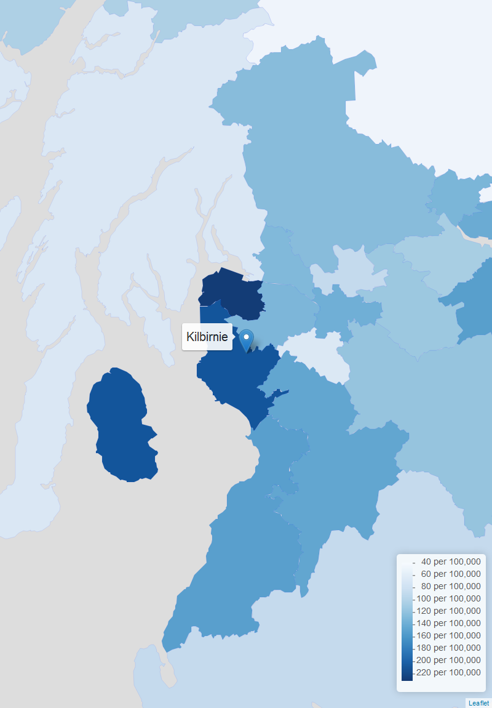

```{r setup, include=FALSE}
knitr::opts_chunk$set(echo = TRUE, fig.width = 12, fig.align = "center")
library(tidyverse)
library(plotly)
fig_all_five <- read_rds("pics/all_five_scot.rds")
fig_all_five_plotly <- ggplotly(fig_all_five)
map_income_deprived <- read_rds("pics/map_income_deprived_zoom.rds")
map_alcohol_hospital <- read_rds("pics/map_alcohol_hospital_zoom.rds")
map_drug_hospital <- read_rds("pics/map_drug_hospital_zoom.rds")

```

# Overview

The information here is sourced from the Scottish Public Health Observatory ([ScotPHO](https://www.scotpho.org.uk/)) which allows you to compare different health and social indicators across areas and time.

## Inequalities
Notable inequalities in the Garnock Valley and Kilbirnie areas include:

* Young people living in the most income deprived quintile            
* Population within 500 metres of a derelict site                     
* Child protection with parental alcohol misuse                       
* All-cause mortality among the 15-44 year olds                       
* Drug-related hospital stays, aged 11-25 years                       
* Road traffic accident casualties                                    
* Children referred to the Children's Reporter for care and protection
* Child protection with parental drug or alcohol misuse               
* Child protection with parental drug misuse                          
* People living in 15% most 'access deprived' areas                   
* Young people living in the most access deprived quintile            
* Young people living in the most crime deprived quintile             
* Mid-year population estimate - all ages                             
* Quit attempts                                                       
* Exposure to secondhand smoke at 6-8 weeks                           
* Premature births                                                    
* Early deaths from coronary heart disease (<75)                      
* Drug-related hospital stays                        

---

* Alcohol related hospital stays, ages 11-25 years
* Alcohol related mortality, ages 11-25 years
* Children in low income families
* Drug related hospital stays
* Drug related hospital stays, ages 11-25 years
* Employment rate for 16-24 year olds


5 selected indicators to look at are:

* Young people living in the most income deprived quintile            
* Population within 500 metres of a derelict site 
* Drug-related hospital stays, aged 11-25 years   
* Alcohol related hospital stays, ages 11-25 years
* Employment rate for 16-24 year olds


## Geographies
Health board, intermediate zone, HSC partnership, HSC locality, Council area, National

```{r echo=FALSE}
fig_all_five
```


# Income Deprivation

Application written in the R programming language [@RCoreTeam] using the Shiny framework [@Chang2015].

```{r echo = FALSE}
map_income_deprived
```


# Derelict Sites

# Drug Related Hospital Stays

```{r echo = FALSE, fig.width=4}
map_drug_hospital
```

# Alcohol Related Hospital Stays

```{r echo = FALSE, fig.width=4}
map_alcohol_hospital
```

# Employment Rate

# References

# Static Images

## Income Deprivation


## Alcohol Related Hospital Stays


## Drug Related Hospital Stays


