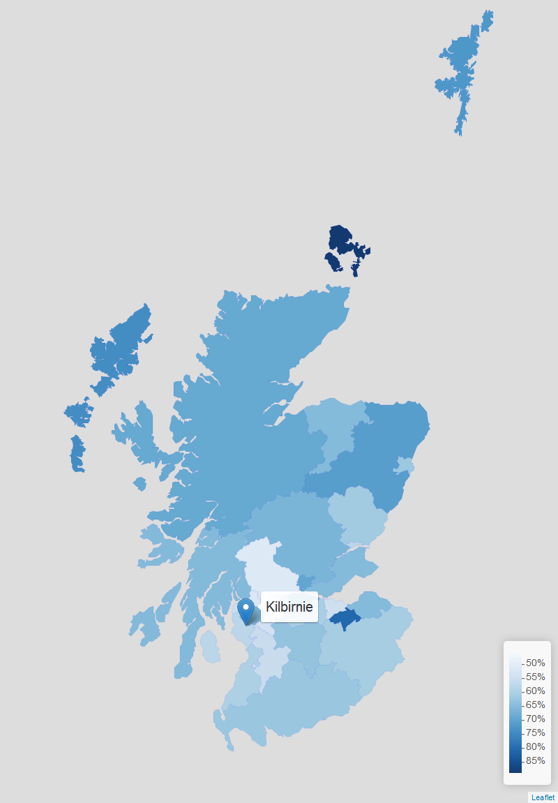

```{r setup, include=FALSE}
knitr::opts_chunk$set(echo = TRUE, fig.width = 12, fig.align = "center")
library(tidyverse)
library(plotly)
trend_alcohol_hospital <- read_rds("pics/trend_alcohol_hospital.rds")
trend_drug_hospital <- read_rds("pics/trend_drug_hospital.rds")
trend_employment <- read_rds("pics/trend_employment.rds")
trend_derelict <- read_rds("pics/trend_derelict.rds")
trend_income_deprived <- read_rds("pics/trend_income_deprived.rds")
map_income_deprived <- read_rds("pics/map_income_deprived_zoom.rds")
map_alcohol_hospital <- read_rds("pics/map_alcohol_hospital_zoom.rds")
map_drug_hospital <- read_rds("pics/map_drug_hospital_zoom.rds")
map_employment <- read_rds("pics/map_employment_zoom.rds")
map_derelict <- read_rds("pics/map_derelict_zoom.rds")
```

# Overview

The information here is sourced from the Scottish Public Health Observatory ([ScotPHO](https://www.scotpho.org.uk/)[@ScotPHO]), which faciliates the comparison of different health and social indicators across different geogrphical areas and time.

After dowloading a data archive via this tool, values from Garnock Valley and Kilbirnie areas were compared to Scotland level data (see `top_indicators.R` code). The following indicators were selected for further investigation:

<!-- * Young people living in the most income deprived quintile             -->
<!-- * Population within 500 metres of a derelict site                      -->
<!-- * Child protection with parental alcohol misuse                        -->
<!-- * All-cause mortality among the 15-44 year olds                        -->
<!-- * Drug-related hospital stays, aged 11-25 years                        -->
<!-- * Road traffic accident casualties                                     -->
<!-- * Children referred to the Children's Reporter for care and protection -->
<!-- * Child protection with parental drug or alcohol misuse                -->
<!-- * Child protection with parental drug misuse                           -->
<!-- * People living in 15% most 'access deprived' areas -->

* *Alcohol related hospital stays*, ages 11-25 years
* *Drug-related hospital stays*, aged 11-25 years   
* *Employment rate* for 16-24 year olds
* Population within 500 metres of a *derelict site* 
* Young people living in the most *income deprived* quintile         

The time trend for these indicators (compared to the Scottish national value for comparison purposes) can be seen below.

<br>

<center>**Time Trend for All Indicators**</center>
<br><br>

Interactive time trends and maps are presented for these indicators in the following sections.

# Alcohol Related Hospital Stays

The national trend is a decrease for alcohol related hospital stays for this age group (11–25 years). While North Ayrshire and NHS Ayrshire & Arran have closed the gap somewhat, they remain consistently and significantly above the national average.

<br>
```{r echo = FALSE}
trend_alcohol_hospital
```

<br><br>
<center>Map of Alcohol Related Hospital Stays (11–25 years)</center>
```{r echo = FALSE}
map_alcohol_hospital
```
<br><br>

# Drug Related Hospital Stays

North Ayrshire and NHS Ayrshire & Arran follow the national trend for drug related stays for this age group (11–25 years), and they remain consistently and significantly above the national average

<br>
```{r echo = FALSE}
trend_drug_hospital
```

<br><br>
<center>Map of Alcohol Related Hospital Stays (11–25 years)</center>
```{r echo = FALSE}
map_drug_hospital
```
<br><br>

# Employment Rate

The employment rate for young people (16–24 years) in North Ayrshire and NHS Ayrshire & Arran has been  *significantly* lower than the national average in the recent past, acheiving above average performance in just one year out of the fourteen shown.

<br>
```{r echo = FALSE}
trend_employment
```

<br><br>
<center>Map of Employment Rate for 16–24 year olds</center>
```{r echo = FALSE}
map_employment
```
<br><br>

# Derelict Sites

All of the geographies presented show a significantly higher proportion of the population live within 500m of a derelict site. Notably the Kilbirnie North, and Kilbirnie South & Longbar zones, exhibit some 2.5&#215; the national average.

<br>
```{r echo = FALSE}
trend_derelict
```

<br><br>
<center>Map of Population Within 500m of a Derelict Site</center>
```{r echo = FALSE}
map_derelict
```
<br><br>


# Income Deprivation

The following geographies show consistently more young people living in the most deprived quintile when compared to the national average: NHS Ayrshire & Arran, Garnock Valley, Kilbirnie South & Longbar, and North Ayrshire. The value of this indicator in the area of Kilbirnie North has consistently risen since 2014 and is now ~12% above the national average.

<br>
```{r echo = FALSE}
trend_income_deprived
```


<br><br>
<center>Map ofthe Percentage of Young People Living in the Most Deprived Quintile</center>
```{r echo = FALSE}
map_income_deprived
```
<br><br>

# Related Documents

# Additional Assets

This section contains static screenshots of the interactive maps and plots in the previous sections.

## Alcohol Related Hospital Stays


## Drug Related Hospital Stays


## Employment Rate





## Derelict Sites


## Income Deprivation


# References

